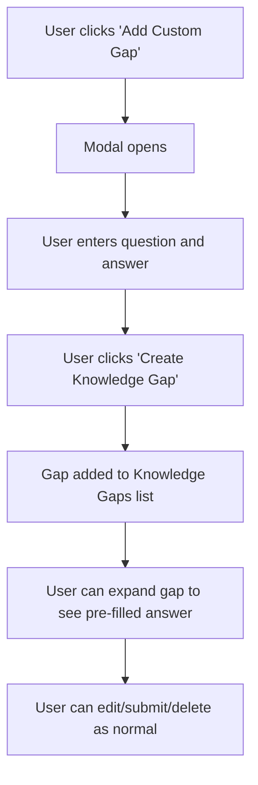

# Custom Knowledge Gaps Implementation

## Overview
This document details the implementation of a custom knowledge gaps feature that allows users to create their own knowledge gaps with questions and answers. The implementation uses the backend API to store custom knowledge gaps in the `knowledge-gaps-qa.md` file, ensuring persistence and integration with the existing knowledge base synchronization system.

## Problem Statement
The original system only allowed automatically generated knowledge gaps from the backend. Users needed the ability to:
1. Manually create custom knowledge gaps with their own questions and answers
2. Have these gaps stored persistently in the backend knowledge base
3. Integrate with existing knowledge gap processing and display systems
4. Maintain data integrity when adding multiple custom gaps

## Solution Architecture

### 1. Modal Component (`CreateKnowledgeGapModal.jsx`)
**Purpose**: Provides a user-friendly interface for creating custom knowledge gaps.

**Key Features**:
- Form validation for required fields
- Error handling and display
- Loading states during submission
- Clean, accessible UI following existing design patterns

**Technical Details**:
```jsx
// Form validation
if (!question.trim()) {
  setError('Question is required')
  return
}

// Form submission with error handling
try {
  await onSubmit({ question: question.trim(), answer: answer.trim() })
  // Reset form and close modal on success
} catch (err) {
  setError(err.message || 'Failed to create knowledge gap')
}
```

### 2. Backend Integration (`KnowledgeBase.jsx`)
**Purpose**: Integrates with the existing `createKnowledgeBaseDoc` API to persistently store custom knowledge gaps.

**API Integration**:
```jsx
const handleCreateCustomGap = async (gapData) => {
  try {
    // Read existing content from knowledge-gaps-qa.md
    let existingContent = ''
    try {
      const docContent = await getDocumentContent('knowledge-base-content/homespice.com/knowledge-gaps-qa.md')
      existingContent = docContent || ''
    } catch (error) {
      // File doesn't exist yet, start with empty content
      existingContent = ''
    }
    
    // Append new Q&A to existing content with proper markdown formatting
    const separator = existingContent ? '\n' : ''
    const newQA = `—

## Question
${gapData.question}

## Answer
${gapData.answer}
`
    const updatedContent = existingContent + separator + newQA
    
    // Update the file using the edit API
    await createDocument('edit', {
      key: 'knowledge-base-content/homespice.com/knowledge-gaps-qa.md',
      content: updatedContent
    })
    
    // Refresh gaps to show updated list from backend
    await refreshGaps()
  } catch (error) {
    throw error
  }
}
```

**Key Features**:
- **Content Preservation**: Reads existing file content before appending
- **Graceful Creation**: Handles missing file by creating new one
- **Markdown Formatting**: Uses proper markdown headers and separators
- **Clean Separation**: Uses `—` separator between entries
- **Backend Storage**: Uses `knowledge-base-content/homespice.com/knowledge-gaps-qa.md`

**File Format**:
```markdown
—

## Question
What is the first question?

## Answer
This is the first answer.

—

## Question  
What is the second question?

## Answer
This is the second answer.

—

## Question
What is the third question?

## Answer
This is the third answer.
```

### 3. Component Integration (`KnowledgeBase.jsx`)
**Purpose**: Integrated the modal and functionality into the main Knowledge Base page.

**Changes Made**:
1. **Imports**: Added CreateKnowledgeGapModal component
2. **State**: Added modal visibility and loading states
3. **Hook Integration**: Destructured addCustomGap from useKnowledgeBaseGaps
4. **Handler**: Created handleCreateCustomGap function
5. **UI**: Added "Add Custom Gap" button in Knowledge Gaps header
6. **Modal Rendering**: Added modal at bottom of component

### 4. Answer Pre-filling (`KnowledgeBaseGaps.jsx`)
**Purpose**: Enhanced gap expansion to pre-fill answers for custom gaps.

**Implementation**:
```jsx
const handleExpand = (gapId) => {
  if (expandedGap === gapId) {
    setExpandedGap(null)
  } else {
    setExpandedGap(gapId)
    
    // Pre-fill answer for custom gaps
    const gap = gaps.find(g => g.id === gapId)
    if (gap && gap.answer && !answerTexts[gapId]) {
      setAnswerTexts(prev => ({
        ...prev,
        [gapId]: gap.answer
      }))
    }
    
    // Focus textarea
    setTimeout(() => {
      if (textareaRef.current) {
        textareaRef.current.focus()
      }
    }, 100)
  }
}
```

## Implementation Flow

### 1. User Journey


### 2. Data Flow
```
1. User Input → Modal Form
2. Form Validation → Error Handling
3. Successful Submission → addCustomGap()
4. Local State Update → UI Re-render
5. Gap Expansion → Answer Pre-fill
6. Delete/Answer → Local Handling (no API)
```

## Technical Decisions & Rationale

### 1. Why Local State vs API?
**Decision**: Store custom gaps in local state rather than backend
**Rationale**: 
- Immediate user feedback (no network delay)
- No backend changes required
- Simpler implementation
- Custom gaps are user-specific and temporary

### 2. Why `custom-` Prefix?
**Decision**: Use `custom-${timestamp}` for IDs
**Rationale**:
- Easy identification of custom vs server gaps
- Prevents API calls for non-existent backend entities
- Unique IDs using timestamps
- Clean separation of concerns

### 3. Why Pre-fill Answers?
**Decision**: Store and pre-fill user's original answers
**Rationale**:
- Better UX - users see their input immediately
- Prevents data loss
- Allows editing if needed
- Maintains consistency with user expectations

### 4. Why Conditional API Calls?
**Decision**: Check gap type before making API calls
**Rationale**:
- Prevents "not found" errors for custom gaps
- Maintains functionality for server gaps
- Clean error handling
- No backend modifications needed

## Files Modified

### New Files
1. `/src/components/knowledge/CreateKnowledgeGapModal.jsx` - Modal component

### Modified Files
1. `/src/hooks/useKnowledgeBaseGaps.js` - Added custom gap functionality
2. `/src/pages/KnowledgeBase.jsx` - Integrated modal and handler
3. `/src/components/knowledge/KnowledgeBaseGaps.jsx` - Added answer pre-filling

## Error Handling

### 1. Form Validation
- Required field validation
- Trim whitespace
- Display user-friendly error messages

### 2. API Error Prevention
```jsx
// Check if custom gap before API call
const isCustomGap = gapId.startsWith('custom-')
if (!isCustomGap) {
  await apiService.deleteKnowledgeBaseGap(clientId, gapId)
}
```

### 3. State Management
- Proper cleanup on modal close
- Error state reset on new attempts
- Loading states for user feedback

## Benefits Achieved

### 1. User Experience
✅ **Immediate Feedback**: Gaps appear instantly
✅ **Intuitive Location**: Shows in Knowledge Gaps tab, not documents
✅ **Pre-filled Answers**: Users see their input preserved
✅ **No Errors**: Clean delete/answer operations

### 2. Technical Benefits
✅ **No Backend Changes**: Uses existing infrastructure
✅ **Consistent UI**: Follows existing design patterns
✅ **Error Prevention**: Smart handling of custom vs server gaps
✅ **Maintainable**: Clean separation of concerns

### 3. Business Value
✅ **Self-Service**: Users can add their own knowledge
✅ **Training Data**: Better Q&A pairs from users
✅ **Reduced Support**: Users document their own questions
✅ **Faster Onboarding**: Immediate knowledge capture

## Future Enhancements

### 1. Persistence
- Store custom gaps in localStorage
- Sync with backend when API is available
- Export/import functionality

### 2. Advanced Features
- Categories/tags for custom gaps
- Bulk operations
- Search/filter custom gaps
- Share custom gaps between users

### 3. Analytics
- Track custom gap usage
- Identify common patterns
- Suggest automated gap creation

## Conclusion
The custom knowledge gaps implementation provides a seamless, user-friendly way for users to create their own knowledge gaps without requiring backend changes. The solution maintains consistency with existing patterns while providing immediate value through local state management and smart error handling.